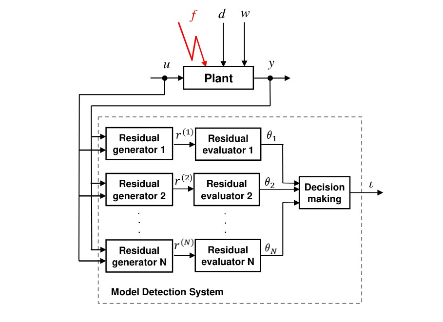

# Model detection basics 

## Synthesis models

The underlying synthesis techniques of model detection systems rely on multiple-model
descriptions of physical fault cases. 
The  multiple-model description represents a very general way to describe plant models with various faults. For example, _extreme_ variations of parameters representing the so-called _parametric faults_, can be easily described by multiple models.
Since different degrees of performance degradations of a plant behaviour can be also described via multiple models,  
model detection techniques have potentially the capability to address certain fault identification aspects too. Two basic forms of synthesis models are described in what follows.

For physically modelled faults, each fault mode leads to a distinct component model.
Assume that we have $N$ _stable_ LTI component models describing the fault-free and faulty systems,
 and for $j = 1, \ldots , N$ the $j$-th model  is specified in the input-output form
```math
{\mathbf{y}}^{(j)}(\lambda) =
G_u^{(j)}(\lambda){\mathbf{u}}(\lambda)
+ G_d^{(j)}(\lambda){\mathbf{d}}^{(j)}(\lambda)
+ G_w^{(j)}(\lambda){\mathbf{w}}^{(j)}(\lambda) ,
```
where  ``{\mathbf{y}}^{(j)}(\lambda)``, ``{\mathbf{u}}(\lambda)``,
``{\mathbf{d}}^{(j)}(\lambda)`` and
``{\mathbf{w}}^{(j)}(\lambda)`` (with boldface notation), are the Laplace-transformed (in the continuous-time case) or Z-transformed (in the discrete-time case) time-dependent vectors,
respectively, the measured system output
$y^{(j)}(t) \in R^{p}$, control
input $u(t) \in R^{m_u}$, disturbance input $d^{(j)}(t) \in R^{m_d^{(j)}}$ and noise input $w^{(j)}(t) \in R^{m_w^{(j)}}$, and where
$G_u^{(j)}(\lambda)$, $G_d^{(j)}(\lambda)$ and $G_w^{(j)}(\lambda)$  are proper and stable TFMs from
the corresponding plant inputs to outputs. In general, the disturbance and noise vectors can have different dimensions for different component systems. 

_Important notice:_ The requirement of stability of the component models is not necessary for the mathematical solution of the model detection problems formulated below. Nevertheless, this requirement 
is essential for the practical applicability of model detection techniques, because the detection of   
unstable component models is unrealistic in presence of inherent modelling related uncertainties. 

Input-output models of the above form are useful in formulating various model detection problems, in deriving general solvability conditions and in describing conceptual synthesis procedures. However, these models are generally not suited for numerical computations, due to the  potentially high sensitivity of polynomial-based model representations.

For computational purposes, instead of the above input-output model with the $j$-th compound TFM $[\, G_u^{(j)}(\lambda) \; G_d^{(j)}(\lambda) \; G_w^{(j)}(\lambda) \,]$, equivalent state-space models are used with the $j$-th model having the form
```math
\begin{array}{rcl}E^{(j)}\lambda x^{(j)}(t) &=& A^{(j)}x^{(j)}(t) + B^{(j)}_u u(t) + B^{(j)}_d d^{(j)}(t) + B^{(j)}_w w^{(j)}(t)  \, ,\\
y^{(j)}(t) &=& C^{(j)}x^{(j)}(t) + D^{(j)}_u u(t) + D^{(j)}_d d^{(j)}(t) + D^{(j)}_w w^{(j)}(t)  \, , \end{array} 
```
where $x^{(j)}(t) \in R^{n^{(j)}}$ is the state vector of the $j$-th system and,  generally, can have different dimensions for different component systems, and  
where $\lambda x^{(j)}(t) := \dot{x}^{(j)}(t)$ or $\lambda x^{(j)}(t) := x^{(j)}(t+1)$ depending on the
type of the system, continuous- or discrete-time, respectively.  Each matrix $E^{(j)}$ is generally invertible and is frequently  taken as $E^{(j)} = I_{n^{(j)}}$. 
The following relations hold between the elements of the two representations:
```math
\begin{array}{lll} G_u^{(j)}(\lambda) &=& C^{(j)}(\lambda E^{(j)}-A^{(j)})^{-1}B_u^{(j)}+D_u^{(j)} \\
G_d^{(j)}(\lambda) &=& C^{(j)}(\lambda E^{(j)}-A^{(j)})^{-1}B_d^{(j)}+D_d^{(j)} \\
G_w^{(j)}(\lambda) &=& C^{(j)}(\lambda E^{(j)}-A^{(j)})^{-1}B_w^{(j)} + D_w^{(j)} 
\end{array}
```

The state-space synthesis models underly the definition of the [`MDModel`](@ref) and  [`MDMModel`](@ref)synthesis model objects used in the functions for the synthesis of model detection filters.

## Residual generation

A typical model detection system contains a bank of $N$ residual generation filters (or residual generators) 
```math
{\mathbf{r}}^{(i)}(\lambda) = Q^{(i)}(\lambda)\left[ \begin{array}{c}
{\mathbf{y}}(\lambda)\\{\mathbf{u}}(\lambda)\end{array}\right] , \; i = 1, \ldots, N,
```
where the $i$-th filter $Q^{(i)}(\lambda)$ generates the corresponding $i$-th residual component 
$r^{(i)}(t)$ (scalar or vector). The
dimension $q_i$ of the residual vector component $r^{(i)}(t)$ can be chosen always one, but occasionally values $q_i > 1$ may provide better sensitivity to model mismatches.



For decision making, an $N$-dimensional  evaluation vector $\theta$ is employed, whose $i$-th component $\theta_i$ usually represents an approximation of  $\|r^{(i)}\|_2$, the $\mathcal{L}_2$- or $\ell_2$-norm of $r^{(i)}$. Then, an $N$-dimensional decision vector $\iota$  is built, whose $i$-th component is set to 0 if $\theta_i \leq \tau_i$ and 1 otherwise, where $\tau_i$ is a suitable threshold. The $j$-th model is _detected_ if $\iota_j =0$ and $\iota_i =1$ for all $i \not = j$. It follows that model detection can be interpreted as a particular type of
week fault isolation with $N$ signature vectors, where the $N$-dimensional $j$-th signature vector has all elements set to one, excepting the $j$-th entry which is set to zero. An alternative decision scheme relevant for addressing multiple-model based adaptive control prooblems can also be devised if $\theta_i$ is associated with a distance function from the current model to the $i$-th model. In this case, if $j$ is the index of least component of $\theta$, then setting $\iota_j =0$ and $\iota_i =1$ for all $i \not = j$, the above decision scheme selects that model $j$ which best fits with the current model characterized by the measured input and output data. Moreover, to reduce the real-time computational burden, it is occasionally possible to use a number of filters $M$, with $M \ll N$.  For example, a single filter (i.e., $M = 1$) can be sufficient to perform model detection provided the ranges of values of $\theta_1$ for a selected class of persistent test signals correctly reflect the distances from the current model to the first component model.   

Assuming $y(t) = y^{(j)}(t)$, the residual signal component $r^{(i)}(t)$ generally depends on all system inputs $u(t)$, $d^{(j)}(t)$ and $w^{(j)}(t)$
via the system output $y^{(j)}(t)$.  The _internal form_ of the $i$-th filter driven by the $j$-th model is obtained by replacing ${\mathbf{y}}(\lambda)$ with
${\mathbf{y}}^{(j)}(\lambda)$. To make explicit the dependence of $r^{(i)}$ on the $j$-th model, we will use $\widetilde r^{(i,j)}$, to denote the $i$-th residual output for the $j$-th model. After replacing ${\mathbf{y}}(\lambda)$ with ${\mathbf{y}}^{(j)}(\lambda)$,  we obtain
```math
\begin{array}{lrl}
{\widetilde{\mathbf{r}}}^{(i,j)}(\lambda) &:=& R^{(i,j)}(\lambda) \left[ \begin{array}{c}{\mathbf{u}}(\lambda) \\ {\mathbf{d}}^{(j)}(\lambda)\\ {\mathbf{w}}^{(j)}(\lambda)\end{array}\right]\\ \\[-2mm] &=&
R_u^{(i,j)}(\lambda){\mathbf{u}}(\lambda) +
R_d^{(i,j)}(\lambda){\mathbf{d}}^{(j)}(\lambda) +
R_w^{(i,j)}(\lambda){\mathbf{w}}^{(j)}(\lambda) \, ,
\end{array} 
```
with $R^{(i,j)}(\lambda) := \big[ R_u^{(i,j)}(\lambda) \mid R_d^{(i,j)}(\lambda) \mid R_w^{(i,j)}(\lambda)\big]$ defined as
```math
R^{(i,j)}(\lambda) :=
Q^{(i)}(\lambda)\left[ \begin{array}{c|c|c} G_u^{(j)}(\lambda) & G_d^{(j)}(\lambda) & G_w^{(j)}(\lambda) \\
I_{m_u} & 0 & 0 \end{array}\right] \, .
```

This leads to the following structured residual vector $r(t)$ and block-structured filter $Q(\lambda)$ 
```math
r(t) = \left[ \begin{array}{c} r^{(1)}(t)\\ \vdots \\ r^{(N)}(t) \end{array}\right] , \;
Q(\lambda) = \left[ \begin{array}{c} Q^{(1)}(\lambda)\\ \vdots \\ Q^{(N)}(\lambda) \end{array}\right]  \,.
```
For a successfully designed set of stable and proper filters $Q^{(i)}(\lambda)$, $i = 1, \ldots, N$, the
corresponding internal representations $R^{(i,j)}(\lambda)$ are also a proper and stable.

The above bank of fault detection filters is the basis of the definition of the model detection filter object [`MDFilter`](@ref) and its internal form [`MDFilterIF`](@ref).

# Structure matrix

We can associate to the $N\times N$ set of TFMs $R^{(i,j)}(\lambda)$ the $N\times N$ binary
_structure matrix_ $S_{R}$, whose $(i,j)$-th element is defined as
```math
\begin{array}{llrll} S_{R}(i,j) &=& 1 & \text{ if } & R_u^{(i,j)}(\lambda) \not=0 \; ,\\
S_{R}(i,j) &=& 0 & \text{ if } & R_u^{(i,j)}(\lambda) =0 \, .
\end{array}
```
If $S_{R}(i,j) = 1$
then we say that the $i$-th residual component is sensitive to the control inputs of the $j$-th model, while if $S_{R}(i,j) = 0$ then the control inputs of the $j$-th model are decoupled from $i$-th residual component. The $N$ columns of $S_{R}$ are called _model signatures_ and play the same role in the decision making as the structure matrices employed for fault isolation. Since each column of $S_{R}$ is associated with the corresponding model, model detection can be performed by comparing the resulting binary decision vector $\iota$ in the model detection system (i.e., the signatures of fired or not fired residual components) with the signatures coded in the columns of $S_{R}$. All targeted  model detection signatures have the _standard_ shape below, as for example, for $N = 4$ 
```math
S = \left[ \begin{array}{cccc} 0 & 1 & 1 & 1\\ 1 & 0 & 1 & 1\\1 & 1 & 0 & 1\\ 1 & 1 & 1 & 0 
\end{array} \right] .
```


The above definition of the structure matrix $S_{R}$ can be extended to include the effects of disturbance inputs, by using  $\big[ R_u^{(i,j)}(\lambda) \; R_d^{(i,j)}(\lambda) \big]$ instead 
$R_u^{(i,j)}(\lambda)$. This possibility is relevant especially for the cases when there are no control inputs to be actively manipulated. 

The above defined binary matrix is also known as the _weak structure matrix_ associated to the
zero/nonozero components of $R^{(i,j)}(\lambda)$. We can also define the _strong structure matrix_, which is related to the zero/nonzero blocks of the frequency response of $R^{(i,j)}(\lambda)$ evaluated for a set of 
relevant complex frequencies $\Omega$ characterizing the classes of persistent input signals. For example, to a _real_ frequency $\omega$ which characterizes sinusoidal inputs, the corresponding _complex_ frequency in $\Omega$ is $j\omega$ for a continuous-time system or $\exp(j\omega T_s)$ for a discrete-time system with sampling time $T_s$ (thus, the null frequency characterizes constant faults). The strong structure matrix is defined as
```math
\begin{array}{llrll} S_{R}(i,j) &=& 1 & \text{ if } & R_u^{(i,j)}(\lambda_z) \not=0 \;  \text{ for all }  \lambda_z \in \Omega ,\\
S_{R}(i,j) &=& 0 & \text{ if } & R_u^{(i,j)}(\lambda_z) = 0 \, \text{ for any } \lambda_z \in \Omega .
\end{array} 
```

For the determination of the weak and strong structure matrices the functions  [`mdspec`](@ref) and  [`mdsspec`](@ref) are available.  


# Model detection problems

In this section we formulate the exact and approximate synthesis problems of model detection filters for a collection of $N$ _stable_ LTI systems.
As in the case of the EFDIP or AFDIP, we seek $N$ linear residual generators  (or model
 detection filters), which
process the measurable system outputs $y(t)$ and known control
inputs $u(t)$ and generate the $N$ residual signals $r^{(i)}(t)$  for $i = 1, \ldots, N$. These signals
serve for decision-making by comparing the pattern of fired and not fired residuals  with the signatures coded in the columns of the associated standard $N\times N$ structure matrix $S$ with zeros on the diagonal and ones elsewhere.
The standard requirements for the TFMs of the filters $Q^{(i)}(\lambda)$  are _properness_  and _stability_. For practical purposes, the orders of the filter $Q^{(i)}(\lambda)$ must be as small as possible. Least order filters $Q^{(i)}(\lambda)$ can be usually achieved by employing scalar output filters.

In analogy to the formulations of the EFDIP and AFDIP,
we use the internal form of the $i$-th residual generator to formulate the basic model detection requirements. Independently of the presence of the noise inputs $w^{(j)}$, we will target that the $i$-th residual is exactly decoupled from the $i$-th model if $w^{(i)} \equiv 0$ and is sensitive to the $j$-th model, for all $j \not = i$.
These requirements can be easily translated into algebraic conditions using the internal form of the $i$-th residual generator. We denote $\widetilde R^{(i,j)}(\lambda)$ alternatively as
```math
\widetilde R^{(i,j)}(\lambda) := [\, R_u^{(i,j)}(\lambda) \;\; R_d^{(i,j)}(\lambda)\,] ,
```
if both control and disturbance inputs are involved in the model detection, or as
```math
\widetilde R^{(i,j)}(\lambda) := R_u^{(i,j)}(\lambda) ,
```
if only the control inputs have to be employed for model detection. Then the following conditions have to be always fulfilled for $i = 1, \ldots, N$:
```math
\begin{array}{ll}
  (i) & [\, R_u^{(i,i)}(\lambda) \;\; R_d^{(i,i)}(\lambda)\,] = 0 , \\
  (ii) & \widetilde R^{(i,j)}(\lambda) \not = 0, \;\; \forall j \not = i , \;\; j = 1,\ldots, N . 
\end{array}
```

Here, $(i)$ is the _model decoupling condition_ for the $i$-th model in the $i$-th residual component, while $(ii)$ is the _model sensitivity condition_ of the $i$-th residual component to all models, excepting the $i$-th model.
In the case when condition $(i)$ cannot be fulfilled (e.g., due to lack of sufficient measurements), some (or even all) components of $d^{(j)}(t)$ can be redefined as noise inputs and included in $w^{(j)}(t)$.

In what follows, we formulate the exact and approximate model detection problems.


### Exact model detection problem (EMDP)
**EMDP:** Determine $N$ stable residual generator filters $Q^{(i)}(\lambda)$ for $i = 1, \ldots, N$ such that
```math
\begin{array}{ll}
  (i) & [\, R_u^{(i,i)}(\lambda) \;\; R_d^{(i,i)}(\lambda)\,] = 0 , \\
  (ii) & \widetilde R^{(i,j)}(\lambda) \not = 0, \;\; \forall j \not = i , \;\; j = 1,\ldots, N .
\end{array}
```
The conditions $(i)$ and $(ii)$ express the _model detectability_ condition [1].

The EMDP can be formulated with the stronger requirement that $\widetilde R^{(i,j)}(\lambda)$ do not vanish for a set of 
relevant complex frequencies $\Omega$ characterizing the classes of persistent inputs:

**EMDP with strong model detectability:**  For a given set of complex frequencies $\Omega$, 
determine $N$ stable residual generator filters $Q^{(i)}(\lambda)$ for $i = 1, \ldots, N$ such that
```math
\begin{array}{ll}
  (i) & [\, R_u^{(i,i)}(\lambda) \;\; R_d^{(i,i)}(\lambda)\,] = 0 , \\
  (ii)' & \widetilde R^{(i,j)}(\lambda_z) \not = 0, \forall \lambda_z \in \Omega, \;\; \forall j \not = i , \;\; j = 1,\ldots, N .
\end{array}
```
The conditions $(i)$ and $(ii)'$ express the _strong model detectability_ condition [1].

For the synthesis of model detection filters which solve the EMDP the function [`emdsyn`](@ref) is available. 

### Approximate model detection problem (AMDP)
**AMDP:** Determine $N$ stable residual generator filters $Q^{(i)}(\lambda)$ for $i = 1, \ldots, N$ such that
```math
\begin{array}{ll}
  (i) & [\, R_u^{(i,i)}(\lambda) \;\; R_d^{(i,i)}(\lambda)\,] = 0 , \\
  (ii) & \widetilde R^{(i,j)}(\lambda) \not = 0, \;\; \forall j \not = i, \;\; j = 1,\ldots, N \\
  (iii) & R_{w}^{(i,i)}(\lambda) \approx 0 . 
\end{array}
```

Here, $(iii)$ is the _attenuation condition_ of the effects of noise inputs. 
A similar formulation can be done for the AMDP with strong model detectability.  

For the synthesis of model detection filters which solve the AMDP the function [`amdsyn`](@ref) is available. 

## Analysis and performance evaluation

### Distances between models
For the setup of model detection applications, an important first step is the selection of a representative set of component models to serve for the design of model detection filters. A practical requirement to set up multiple models is to choose a set of component models, such that, each component model is sufficiently far away of the rest of models. A suitable tool to measure the distance between two models is the $\nu$-gap metric introduced in [2]. For two transfer function matrices $G_1(\lambda)$ and $G_2(\lambda)$ of the same dimensions, we denote $\delta_\nu(G_1(\lambda),G_2(\lambda))$ the 
$\nu$-gap metric based distance [2], which generally satisfies $0 \leq \delta_\nu(G_1(\lambda),G_2(\lambda))\leq 1$.
If $\delta_\nu\big(G_1(\lambda),G_2(\lambda)\big)$ is small, then we can say that
$G_1(\lambda)$ and $G_2(\lambda)$  are close and it is likely that a model detection filter suited for $G_1(\lambda)$ will also work with $G_2(\lambda)$, and therefore, one of the two models can be probably removed from the set of component models. On the other side, if $\delta_\nu\big(G_1(\lambda),G_2(\lambda)\big)$  is nearly equal to 1, then $G_1(\lambda)$ and $G_2(\lambda)$ are sufficiently distinct, such that an easy discrimination between the two models is possible. If the two models have the same number of outputs but different numbers of inputs, then $G_1(\lambda)$ and $G_2(\lambda)$ can be suitably padded with zero columns to arrive to a pair with equal number of columns.  

For a set of $N$ component models, it is useful to determine the pairwise $\nu$-gap distances between the control input channels of the component models by defining the symmetric matrix $\Delta$, whose $(i,j)$-th entry is the $\nu$-gap distance between the transfer function matrices of the $i$-th and $j$-th model
```math
\Delta_{ij} := \delta_\nu\big(G_u^{(i)}(\lambda),G_u^{(j)}(\lambda)\big) . 
```
It follows that $\Delta$ has all its diagonal elements zero. For model detection applications all  off-diagonal elements of $\Delta$ must be nonzero, otherwise there are models which can not be potentially discriminated.
The above definition of the distances between the $i$-th and $j$-th models focuses only on the control input channels. In most of practical applications of the model detection, this is perfectly justified by the fact that, a certain control activity is always necessary, to ensure reliable discrimination among models, independently of the presence or absence of disturbances. However, if the disturbance inputs are relevant to perform model detection (e.g., there are no control inputs), then the definition of $\Delta$ can be modified to include the disturbance inputs as well
```math
\Delta_{ij} := \delta_\nu\big(\big[\,G_u^{(i)}(\lambda)\;G_d^{(i)}(\lambda)\,\big],
\big[\,G_u^{(j)}(\lambda)\;G_d^{(j)}(\lambda)\,\big]\big) .
```
Recall that padding with zeros columns may be necessary if $G_d^{(i)}(\lambda)$ and $G_d^{(j)}(\lambda)$ have different number of columns. 

If $\lambda_k$, $k = 1, \ldots, n_f$, is a set of $n_f$ frequency values, then we can define the maximum of the point-wise distances
```math
\Delta_{ij} := \max_k\delta_\nu\big(G_u^{(i)}(\lambda_k),G_u^{(j)}(\lambda_k)\big) ,
```
or
```math
\Delta_{ij} := \max_k\delta_\nu\big(\big[\,G_u^{(i)}(\lambda_k)\;G_d^{(i)}(\lambda_k)\,\big],
\big[\,G_u^{(j)}(\lambda_k)\;G_d^{(j)}(\lambda_k)\,\big]\big) .
```

Besides the $\nu$-gap distance between two transfer function matrices, it is possible to use distances defined in terms of the $\mathcal{H}_\infty$ norm or the $\mathcal{H}_2$ norm of the difference between them:
```math
 \Delta_{ij} := \big\|G_u^{(i)}(\lambda)-G_u^{(j)}(\lambda)\big\|_\infty 
```
or
```math
\Delta_{ij} := \big\|G_u^{(i)}(\lambda)-G_u^{(j)}(\lambda)\big\|_2. 
```
If $\lambda_k$, $k = 1, \ldots, n_f$, is a set of $n_f$ frequency values, then, instead of the above norm-based distances, we can use the maximum of the point-wise distances
```math
\Delta_{ij} := \max_k\big\|G_u^{(i)}(\lambda_k)-G_u^{(j)}(\lambda_k)\big\|_2. 
```

For the evaluation of the above distances between component models the function [`mddist`](@ref) is available. A second function [`mddist2c`](@ref) can be employed to compute the pairwise distances between two sets of component models. In particular, this function is usefull to assess the nearness of a current model to the set of component models employed for model detection. 

### Distance mapping performance 

One of the goals of the model detection is to achieve a special mapping of the distances between $N$ component models using $N$ model detection filters such that the norms of the transfer function matrices $R_u^{(i,j)}(\lambda)$  or of $\big[\, R_u^{(i,j)}(\lambda)\; R_d^{(i,j)}(\lambda)\,\big]$ in the internal forms of the filters qualitatively reproduce the $\nu$-gap distances expressed by the $\Delta$ matrix above. The preservation of this distance  mapping property is highly desirable, and the choice of model detection filters must be able to ensure this feature (at least partially for the nearest models).  For example, the choice of the $i$-th filter $Q^{(i)}(\lambda)$ as a left annihilator  of $\left[\begin{smallmatrix} G_u^{(i)}(\lambda) & G_d^{(i)}(\lambda) \\ I & 0 \end{smallmatrix}\right]$ ensures (see Remark 6.1 of [1]) that the norm of $\big[\, R_u^{(i,j)}(\lambda)\; R_d^{(i,j)}(\lambda)\,\big]$ can be interpreted as a weighted distance between the $i$-th and $j$-th component models. It follows that the distance mapping performance of a set of model detection filters $Q^{(i)}(\lambda)$, $i = 1, \ldots, N$ can be assessed by computing the mapped distance matrix $\Gamma$, whose $(i,j)$-th entry is
```math
\Gamma_{ij} = \big\| R_u^{(i,j)}(\lambda) \big\|_\infty 
```
or, if the disturbance inputs are relevant,
```math
\Gamma_{ij} = \big\| \big[\, R_u^{(i,j)}(\lambda)\; R_d^{(i,j)}(\lambda)\,\big]\big\|_\infty .
```
Using the above choice of the filter $Q^{(i)}(\lambda)$, we have that all diagonal elements of $\Gamma$ are zero. Additionally, to guarantee model detectability, any valid design of the model detection filters must guarantee that all off-diagonal elements of $\Gamma$ are nonzero. These two properties of $\Gamma$ allows to unequivocally identify the exact matching of the current model with one (and only one) of the $N$ component models.

Two other properties of $\Gamma$ are desirable, when solving model detection applications. The first property is the symmetry of $\Gamma$. In contrast to $\Delta$,   $\Gamma$ is generally not symmetric, excepting for some particular classes of component models and for special choices of model detection filters. For example, this property can be ensured if all component models are stable and have no disturbance inputs, by choosing $Q^{(i)}(\lambda) = \big[\, I \; -G_u^{(i)}(\lambda)\,\big]$, in which case $R_u^{(i,j)}(\lambda) = -R_u^{(j,i)}(\lambda)$. Ensuring the symmetry of $\Gamma$, although very desirable,  is in general difficult to be achieved. In practice, it is often sufficient to ensure via suitable scaling that the gains of first row and first column are equal.

The second desirable property of the mapping $\Delta_{ij} \rightarrow \Gamma_{ij}$ is the _monotonic mapping property_ of distances, which is the requirement that for all $i$ and $k$ ($i, k = 1, \ldots, N$), if $\Delta_{ij} < \Delta_{ik}$, then $\Gamma_{ij} < \Gamma_{ik}$. Ensuring this property, makes easier to address model identification problems for which no exact matching between the current model and any one of the component models can be assumed.

If $\lambda_k$, $k = 1, \ldots, n_f$, is a given set of $n_f$ frequency values, then, instead of the peak distances, we can use the maximum of the point-wise distances over the finite set of frequency values, to assess the strong model detectability.

For the evaluation of the distance mapping performance the function [`mdperf`](@ref) is available. 

### Distance matching performance

To evaluate the distance matching property of the model detection filters in the case when no exact matching between the current model and any one of the component models can be assumed, we can define the corresponding current internal forms as
```math
\big[ \widetilde R_u^{(i)}(\lambda) \mid \widetilde R_d^{(i)}(\lambda) \mid \widetilde R_w^{(i)}(\lambda)\big] :=
Q^{(i)}(\lambda)\left[ \begin{array}{c|c|c} \widetilde G_u(\lambda) & \widetilde G_d(\lambda) & \widetilde G_w(\lambda) \\
I_{m_u} & 0 & 0 \end{array} \right]
```
and evaluate the mapped distances $\gamma_i$, for $i = 1, \ldots, N$, defined as
```math 
\gamma_i := \big\| \widetilde R_u^{(i)}(\lambda) \big\|_\infty 
```
or, if the disturbance inputs are relevant,
```math
\gamma_i := \big\| \big[\,  \widetilde R_u^{(i)}(\lambda)\; \widetilde R_d^{(i)}(\lambda)\,\big]\big\|_\infty .
```
The index $\ell$ of the smallest value $\gamma_\ell$ provides (for a well designed set of model detection filters) the index of the best matching component model of the current model.

If $\lambda_k$, $k = 1, \ldots, n_f$, is a given set of $n_f$ frequency values, then, instead of the above peak distances, we can use the maximum of the point-wise distances over the finite set of frequency values.

For the evaluation of the distance matching performance the function [`mdmatch`](@ref) is available. 


### Model detection noise gaps

The noise attenuation performance of model detection filters can be characterized via the noise gaps achieved by individual filters. The noise gap for the $i$-th filter can be defined in terms of the resulting internal forms as the ratio $\eta_i := \beta_i/\gamma_i$, where
```math
\beta_i := \min_{j\neq i} \big\|R_u^{(i,j)}(\lambda)\big\|_\infty 
```
and
```math
\gamma_i := \big\|R_w^{(i,i)}(\lambda)\big\|_\infty .
```
The values of $\beta_i > 0$, for $i = 1, \ldots, N$ characterize the model detectability property of the collection of the $N$ component models, while $\gamma_i$ characterizes the worst-case influence of noise inputs on the $i$-th residual component. If $\gamma_i = 0$ (no noise), then $\eta_i = \infty$.

If the disturbance inputs are relevant for the model detection, then we can use the following alternative definition of $\beta_i$
```math
\beta_i := \min_{j\neq i} \big\|\big[\,R_u^{(i,j)}(\lambda)\; R_d^{(i,j)}(\lambda)\,\big]\big\|_\infty .
```
In this case, $\beta_i > 0$, for $i = 1, \ldots, N$ characterize the (extended) model detectability property of the collection of the $N$ component models.

If $\lambda_k$, $k = 1, \ldots, n_f$, is a given set of $n_f$ frequency values, then we can alternatively use the maximum of the point-wise distances over the finite set of frequency values
```math
\beta_i := \min_{j\neq i} \max_k\big\|R_u^{(i,j)}(\lambda_k)\big\|_\infty 
```
or
```math
\beta_i := \min_{j\neq i} \max_k\big\|\big[\,R_u^{(i,j)}(\lambda_k)\; R_d^{(i,j)}(\lambda_k)\,\big]\big\|_\infty .
```
For the evaluation of the detection noise gaps the function [`mdgap`](@ref) is available. 


### References

[1]   A. Varga, Solving Fault Diagnosis Problems – Linear Synthesis Techniques, Vol. 84 of Studies in Systems, Decision and Control, Springer International Publishing, 2017.

[2]  G. Vinnicombe. Uncertainty and feedback: H∞ loop-shaping and the ν-gap metric. 
    Imperial College Press, London, 2001. 


